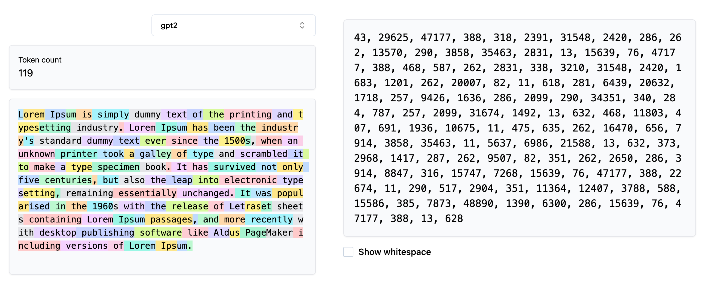
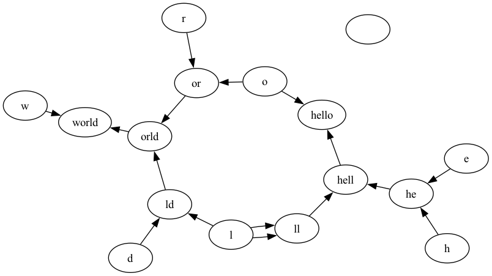

# HuggingFace BytePair Encoding Tokenizer Visualizer library

The library can help you visualize how the encoding process happens in the **Byte-Pair Encoding** tokenizer algorithm when you pass on your text content for tokenization.

Byte-Pair Encoding (BPE) was initially developed as an algorithm to compress texts, and then used by OpenAI for tokenization when pre-training the GPT model. It’s used by a lot of Transformer models, including GPT, GPT-2, RoBERTa, BART, and DeBERTa.

## Byte-Pair Encoding tokenization

BPE training starts by computing the unique set of words used in the corpus (after the normalization and pre-tokenization steps are completed), then building the vocabulary by taking all the symbols used to write those words.

More about the algorithm [here](https://huggingface.co/learn/llm-course/en/chapter6/5)



## Visualizing the Tokenization process

During the tokenization process the input content is compressed into the encoded IDs based on the trained BPE-Tokenizer. During the training process the token-pairs are merged into new token ID based on their frequency of existence in the training corpus.

This library helps in visualizing how the merging process looks like for a given string to be encoded. It generates a **graph** where the nodes are tokens / characters and if a pair of characters are merged, the nodes are connected via directed edges.

### Using the Library

```python
from hf_tokenizer import HfBPETokenizerVisualizer

visualizer = HfBPETokenizerVisualizer(
    pretrained_model_name="gpt2",
    save_visualization=True,
    file_type="png",
    file_name="bpe_tokenization_visualization",
    enable_debug=True,
)

encoded_ids = visualizer.encode("hello world")
print(encoded_ids)
```

### Output Graph generated

